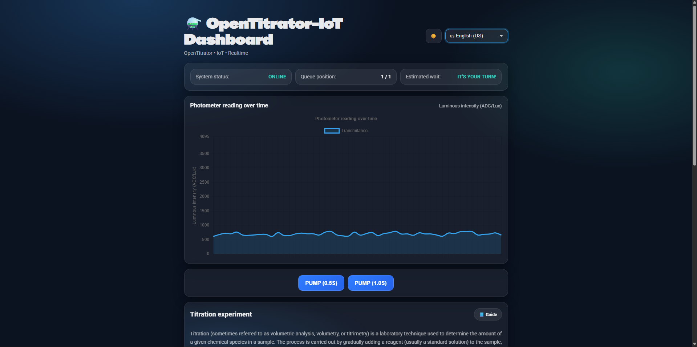

# OpenTitrator-IoT 🧪🤖

**An ultra-low-cost, open-source IoT titration system using custom LDR-based photometry.**




## 🌍 Internationalization (i18n)

This project features a dynamic internationalization system with **RTL support** and **auto-discovery** of language files. The interface currently supports 12 languages (translations generated with AI assistance):

| Flag | Language | Code |
| :---: | :--- | :--- |
| 🇺🇸 | English (US) | `en-US` |
| 🇧🇷 | Português (Brasil) | `pt-BR` |
| 🇪🇸 | Español | `es-ES` |
| 🇫🇷 | Français | `fr-FR` |
| 🇩🇪 | Deutsch | `de-DE` |
| 🇮🇹 | Italiano | `it-IT` |
| 🇷🇺 | Русский | `ru-RU` |
| 🇨🇳 | 中文 (Simplified) | `zh-CN` |
| 🇯🇵 | 日本語 | `ja-JP` |
| 🇰🇷 | 한국어 | `ko-KR` |
| 🇮🇳 | हिन्दी | `hi-IN` |
| 🇮🇩 | Bahasa Indonesia | `id-ID` |
| 🇸🇦 | العربية | `ar` |

---

## 📖 About the Project

**OpenTitrator-IoT** is a platform developed to democratize experimental chemistry education. The system replaces expensive laboratory equipment with low-cost components and custom sensors based on LDRs (Light Dependent Resistors), allowing for precise detection of the endpoint (color change) in acid-base titrations.

Unlike simple automation, this project uses a **modern IoT architecture** with a separation between Client, Server, and Hardware, enabling:

1.  **True Remote Access:** Control via the internet with low latency.
2.  **Queue Management:** Multiple students can watch, but only one controls at a time.
3.  **Frugal Science:** Total estimated cost < 10% of a commercial titrator.

---

## 🚀 Key Features

* **Frugal Optical Sensing:** Proprietary photometer using LED + LDR to detect color changes (e.g., phenolphthalein).
* **Precision Dosing:** Peristaltic pump control via PWM for fine dripping.
* **Auto-Cleaning Cycle:** Automatic flush and rinse system to allow multiple experiments without manual intervention.
* **Real-time Interface:** React dashboard with dynamic charts and video streaming.
* **Scalable Architecture:** Node.js backend with WebSockets (Socket.io).

---

## 📂 Repository Structure (Monorepo)

This repository contains the entire project ecosystem divided into three modules:

```bash
OpenTitrator-IoT/
├── firmware/       # 🧠 C++ Code for ESP32 (PlatformIO)
│                   # Controls motors, reads sensors, and connects via Socket.io
│
├── backend/        # ☁️ Node.js API (Server)
│                   # Manages the user queue and relays commands
│
└── frontend/       # 🎨 Web Interface (React.js)
                    # Visual dashboard for student interaction
````

-----

## 🛠️ Hardware Bill of Materials (BOM)

| Component | Function |
| :--- | :--- |
| **ESP32 DevKit V1** | Main Microcontroller (Wi-Fi + Dual Core) |
| **Peristaltic Pump 12V** | Titrant dosing |
| **H-Bridge Driver (L298N)** | Pump power control |
| **LDR (Photoresistor)** | Light sensor (Color detection) |
| **High Brightness LED** | Light source for the photometer |
| **Magnetic Stirrer** | Custom build (DC Motor + Magnet) |
| **Webcam / ESP32-CAM** | Remote visual feedback |

-----

## ⚡ Getting Started

### 1\. Hardware (Firmware)

Open the `firmware` folder in VS Code with the **PlatformIO** extension.

1.  Configure your Wi-Fi credentials and Server IP in the code.
2.  Connect the ESP32 via USB.
3.  Click `Upload`.

### 2\. Server (Backend)

```bash
cd backend
npm install
npm start
# The server will run on port 3000 (or as defined in .env)
```

### 3\. Interface (Frontend)

```bash
cd frontend
npm install
npm run dev
# Access localhost:5173 (Vite)
```

-----

## 📸 Screenshots

*Nothing here for now.*

-----

## 🤝 Contribution

This is an open-source project focused on education. Feel free to open **Issues** or submit **Pull Requests**.

## 📄 License

Distributed under the MIT License. See `LICENSE` for more information.

<span style="color:gray; font-size:smaller;">🤖 AI Advising: Portions of the code, specifically the internationalization (i18n) translations and CSS boilerplate, were refined using AI tools to accelerate development. All logic was validated and tested physically.</span>
